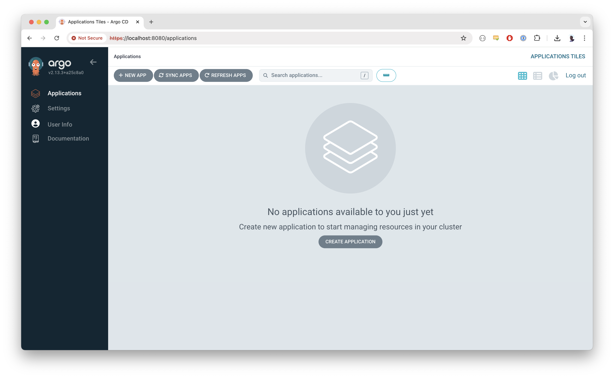

# Chasing the Cloud

This repository contains the code for my VPS Chasing the Cloud. It uses [GitOps](https://www.gitops.tech/) to manage the infrastructure and applications. This README is a work in progress to document things I'm learning along the way.

## Installing Kubernetes (k3s)

For Kubernetes, I'm using [k3s](https://k3s.io/). I picked it because it's lightweight and easy to install.

```bash
curl -sfL https://get.k3s.io | sh -
```

Now, I need to set up `kubectl` to manage the Kubernetes cluster. I already have this installed on my Mac, but I need to set up the config file.

```bash
ssh root@chasingthe.cloud "cat /etc/rancher/k3s/k3s.yaml" > ~/.kube/config && sed -i '' 's|https://127.0.0.1:6443|https://147.93.41.97:6443|' ~/.kube/config
```

I can now check the status of the cluster.

```bash
kubectl get nodes
NAME         STATUS   ROLES                  AGE     VERSION
chasingthe   Ready    control-plane,master   7m57s   v1.31.4+k3s1
```

## Installing ArgoCD

For GitOps, I'm using [ArgoCD](https://argoproj.github.io/cd/). The first time I installed it, I used the official manifest. I'm using the non-HA version.

```bash
kubectl create namespace argocd
kubectl apply -n argocd -f https://raw.githubusercontent.com/argoproj/argo-cd/v2.13.3/manifests/install.yaml
```

I can now check the UI by using a port-forward. Eventually, we'll set up the proper ingress.

```bash
kubectl port-forward svc/argocd-server -n argocd 8080:80
```

I can now login to the UI at [http://localhost:8080](http://localhost:8080). The default credentials are `admin` for the username. The password is stored in a secret in the `argocd` namespace.

The secret can be retrieved with the following command:

```bash
kubectl get secret argocd-initial-admin-secret -n argocd -o jsonpath="{.data.password}" | base64 -d
```

For now, the certificate is not trusted. I'll work on that in a later step when I set up the proper ingress. For now, I can just type `thisisunsafe` (in Chrome) to proceed.



At this point, it's time to make the initial commit to this repository. I'll create this README file and push it now.

```bash
git init
git remote add origin git@github.com:cr0wst/chasingthecloud.git

git add .
git commit -m "Initial commit"

git push -u origin main
```

## Making ArgoCD Self-Managed

After the initial installation, we can make ArgoCD manage itself using GitOps principles. This ensures our ArgoCD installation is version controlled and can be recovered easily.

1. Create a [kustomization](https://kustomize.io/) file that references the upstream ArgoCD manifests:

```yaml
# infrastructure/argocd/kustomization.yaml
apiVersion: kustomize.config.k8s.io/v1beta1
kind: Kustomization

resources:
  - https://raw.githubusercontent.com/argoproj/argo-cd/v2.13.3/manifests/install.yaml
```

2. Create an Application manifest for ArgoCD:

```yaml
# infrastructure/argocd/application.yaml
apiVersion: argoproj.io/v1alpha1
kind: Application
metadata:
  name: argocd
  namespace: argocd
spec:
  project: default
  source:
    repoURL: https://github.com/cr0wst/chasingthecloud.git
    targetRevision: HEAD
    path: infrastructure/argocd
    kustomize: {}
  destination:
    server: https://kubernetes.default.svc
    namespace: argocd
  syncPolicy:
    automated:
      prune: true
      selfHeal: true
```

3. Apply the Application manifest:

```bash
kubectl apply -f infrastructure/argocd/application.yaml
```

Now ArgoCD will manage its own installation. Any changes to ArgoCD should be made through the repository rather than directly using kubectl, following GitOps practices.